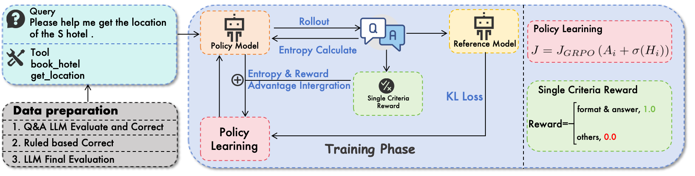
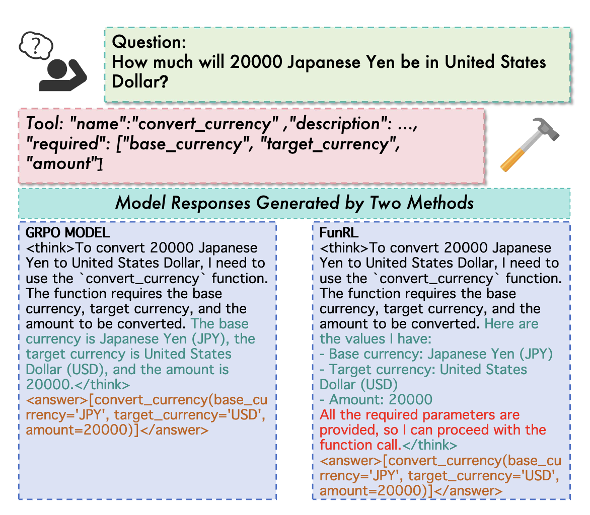
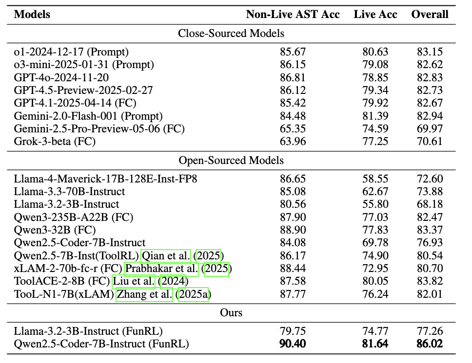

# Exploring Superior Function Calls via Reinforcement Learning

**Our model achieves state-of-the-art performance among open-source models and second place among all models.**

> [!IMPORTANT]
>
> - **We will release all the code, training dataset and model weight, waiting the confidential review of Ant Group.**
> - **Please give a ⭐️ to follow the update which is also an incentive for us.**

## Abstract

> Function calling capabilities are crucial for deploying Large Language Models in real-world applications, yet current training approaches fail to develop robust reasoning strategies. Supervised fine-tuning produces models that rely on superficial pattern matching, while standard reinforcement learning methods struggle with the complex action space of structured function calls. We present a novel reinforcement learning framework—designed to enhance Group Relative Policy Optimization through strategic entropy-based exploration—specifically tailored for function calling tasks. Our approach addresses three critical challenges in function calling: insufficient exploration during policy learning, lack of structured reasoning in chain-of-thought generation, and inadequate verification of parameter extraction. Our two-stage data preparation pipeline ensures high-quality training samples through iterative LLM evaluation and abstract syntax tree validation. Extensive experiments on the Berkeley Function Calling Leaderboard demonstrate that this framework achieves **state-of-the-art** performance among open-source models with 86.02\% overall accuracy, outperforming standard GRPO by up to 6\% on complex multi-function scenarios. Notably, our method shows particularly strong improvements on code-pretrained models, suggesting that structured language generation capabilities provide an advantageous starting point for reinforcement learning in function calling tasks. We will release all the code, models and dataset to benefit the community.

## Overview

<p align="center">

</p>

**Overview of FunRL pipeline** The RL training process adopt a single criteria reward and
use the FunRL which integrates the uncertainty of CoT to better explore the reasoning process.

<p align="center">

</p>

**Thinking Pattern.** Our recipe effectively explores better thought processes in function call scenarios by leveraging entropy in the chain of thought and provides a more formal parameter extraction, verifies in the chain of thought.


<p align="center">

</p>

**Learning curves.** We report the KL divergence and average reward. FunRL corresponds a larger KL divergence, which is driven by the entropy to explore a better thinking pattern.


## Main Result
<p align="center">

</p>


## Citation
```md
@article{FunReason,
  title={FunReason: Enhancing Large Language Models' Function Calling via Self-Refinement Multiscale Loss and Automated Data Refinement},
  author={Bingguang Hao, Maolin Wang, Zengzhuang Xu, Cunyin Peng, Yicheng Chen, Xiangyu Zhao, Jinjie Gu, Chenyi Zhuang},
  journal={arXiv preprint arXiv:2505.20192},
  year={2025}
}
```